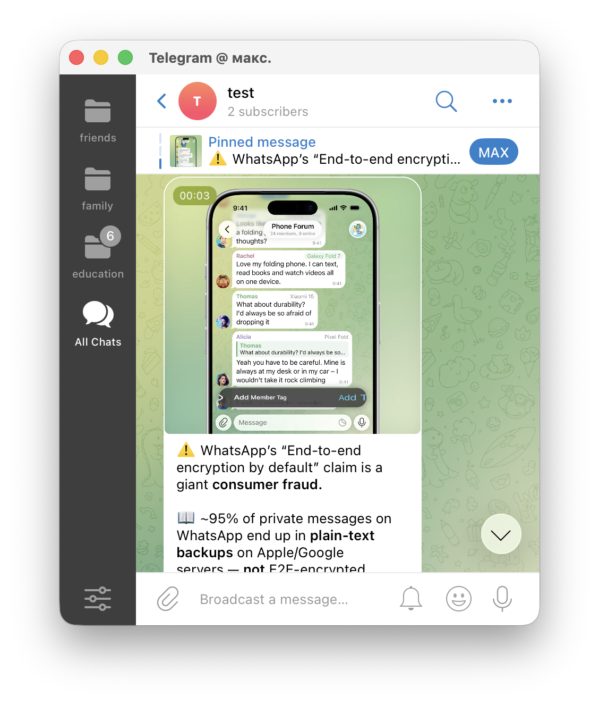
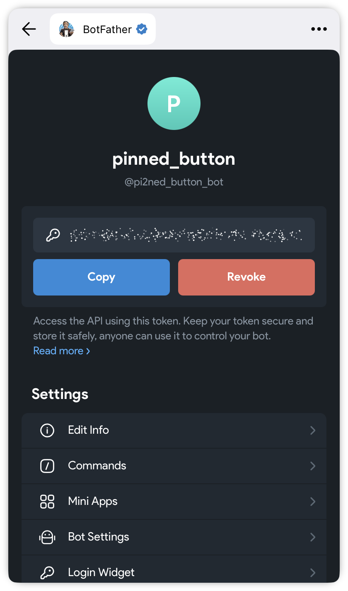

# Telegram Pinned Button Utility

Небольшая Python-утилита для публикации закреплённого поста в Telegram-канале с кнопкой перехода по ссылке.

Утилита подходит, если нужно быстро создать пост с кнопкой, например:

- «Перейти»;
- «Открыть сайт»;
- «Подписаться»;
- «Подробнее».



---

## Возможности

Утилита умеет:

- отправлять текстовый пост в Telegram-канал;
- добавлять кнопку с переходом по URL;
- автоматически закреплять опубликованный пост;
- отправлять один медиафайл из корня проекта:
  - фото;
  - видео;
- если медиафайла нет — отправлять только текстовый пост.

> Из-за ограничений Telegram Bot API кнопка добавляется к одному сообщению. Поэтому утилита работает только с одним медиафайлом, а не с медиаальбомом.

---

## Структура проекта

```text
pinned_button/
├── main.py
├── requirements.txt
├── Makefile
├── README.md
└── docs/
    ├── Intro.png
    └── BotFather.png
```

Если нужен пост с фото или видео, один медиафайл кладётся прямо в корень проекта:

```text
pinned_button/
├── main.py
├── requirements.txt
├── Makefile
├── README.md
└── image.jpg
```

или:

```text
pinned_button/
├── main.py
├── requirements.txt
├── Makefile
├── README.md
└── video.mp4
```

---

# Регистрация Telegram-бота

## 1. Откройте BotFather

В Telegram найдите официального бота:

```text
@BotFather
```

Создайте нового бота командой:

```text
/newbot
```

BotFather попросит:

1. ввести название бота;
2. ввести username бота.

Username должен заканчиваться на `bot`.

Пример:

```text
pinned_button_bot
```

После создания BotFather выдаст токен.



---

## 2. Скопируйте токен

Токен выглядит примерно так:

```text
1234567890:AAExampleTokenExampleToken
```

Его нужно вставить в `main.py`:

```python
BOT_TOKEN = "ваш_токен_от_BotFather"
```

Не публикуйте реальный токен в открытом доступе.

---

## 3. Добавьте бота в Telegram-канал

Откройте нужный Telegram-канал и добавьте созданного бота в администраторы.

Боту нужны права:

```text
Публикация сообщений
Редактирование сообщений
Закрепление сообщений
```

Если этих прав не будет, бот не сможет отправить или закрепить пост.

---

# Настройка проекта

Откройте файл `main.py` и заполните настройки в начале файла:

```python
BOT_TOKEN = "ваш_токен_от_BotFather"
CHANNEL_ID = "@username_канала"
URL = "https://example.com"
BUTTON_TEXT = "Перейти"
```

## BOT_TOKEN

Токен Telegram-бота, который выдал BotFather.

Пример:

```python
BOT_TOKEN = "1234567890:AAExampleTokenExampleToken"
```

## CHANNEL_ID

Username Telegram-канала, куда бот должен отправить пост.

Пример:

```python
CHANNEL_ID = "@channel_id"
```

Важно: это должен быть именно username канала, а не обычное название канала.

## URL

Ссылка, которая откроется при нажатии на кнопку.

Пример:

```python
URL = "https://google.com/example"
```

## BUTTON_TEXT

Текст внутри кнопки.

Пример:

```python
BUTTON_TEXT = "Перейти"
```

---

# Текст поста

Текст поста находится в переменной `TEXT`:

```python
TEXT = """
Ваш текст поста
""".strip()
```

Пример:

```python
TEXT = """
Подписывайтесь 👇
""".strip()
```

Если нужно использовать жирный текст, курсив или ссылки, можно использовать HTML-разметку Telegram.

Пример:

```python
TEXT = """
<b>Заголовок</b>

Обычный текст.

<i>Курсивный текст</i>

<a href="https://example.com">Кликабельная ссылка</a>
""".strip()
```

---

# Медиафайл

Утилита может отправить один медиафайл вместе с текстом и кнопкой.

Поддерживаемые форматы фото:

```text
.jpg
.jpeg
.png
.webp
```

Поддерживаемые форматы видео:

```text
.mp4
.mov
.avi
.mkv
```

Рекомендуемый формат для видео — `.mp4`.

Важно: в корне проекта должен быть только один медиафайл.

Если медиафайла нет, бот отправит обычный текстовый пост с кнопкой.

---

# Установка и запуск

Перед запуском должен быть установлен Python 3.

---

## macOS

### 1. Установить зависимости

Через Makefile:

```bash
make install
```

Или вручную:

```bash
python3 -m pip install -r requirements.txt
```

### 2. Запустить утилиту

Через Makefile:

```bash
make run
```

Или вручную:

```bash
python3 main.py
```

---

## Linux

### 1. Установить зависимости

```bash
python3 -m pip install -r requirements.txt
```

Если установлен `make`, можно использовать:

```bash
make install
```

### 2. Запустить утилиту

```bash
python3 main.py
```

Если установлен `make`, можно использовать:

```bash
make run
```

---

## Windows

Откройте PowerShell или CMD в папке проекта.

### 1. Установить зависимости

```bash
py -3 -m pip install -r requirements.txt
```

Если команда `py -3` не работает, используйте:

```bash
python -m pip install -r requirements.txt
```

### 2. Запустить утилиту

```bash
py -3 main.py
```

Если команда `py -3` не работает, используйте:

```bash
python main.py
```

---

# Что произойдёт после запуска

После запуска утилита:

1. проверит, есть ли медиафайл в корне проекта;
2. отправит пост в Telegram-канал;
3. добавит кнопку с переходом по ссылке;
4. закрепит опубликованное сообщение.

---

# Частые ошибки

## Token is invalid

Неверно указан токен бота.

Проверьте значение:

```python
BOT_TOKEN = "..."
```

---

## Forbidden: bot is not a member of the channel chat

Бот не добавлен в канал или указан неправильный `CHANNEL_ID`.

Проверьте:

```text
1. Бот добавлен в канал.
2. Бот является администратором.
3. У бота есть права на публикацию и закрепление сообщений.
4. CHANNEL_ID указан правильно.
```

---

## Сообщение отправилось, но не закрепилось

У бота нет прав на закрепление сообщений.

Выдайте боту право на закрепление или редактирование сообщений в настройках администраторов канала.

---

## Выберите только 1 файл!

В корне проекта найдено больше одного фото или видео.

Оставьте только один медиафайл.